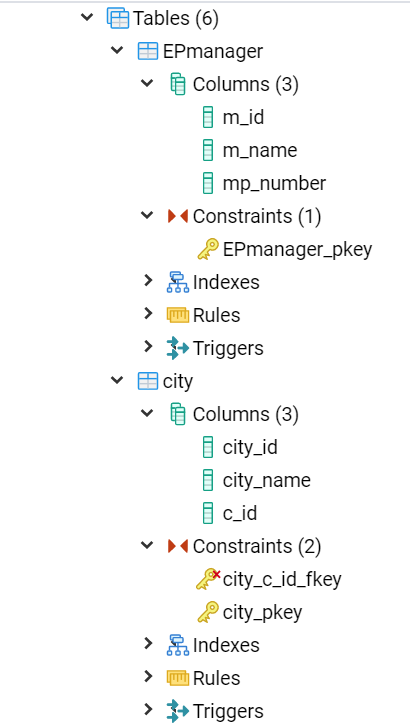
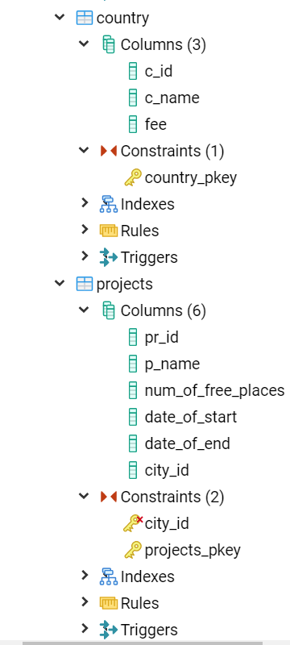
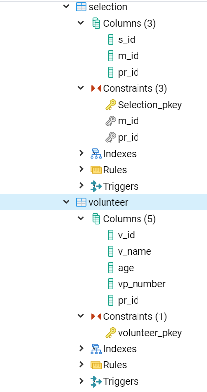
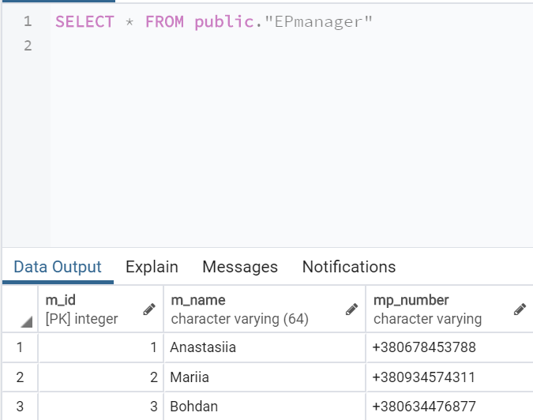
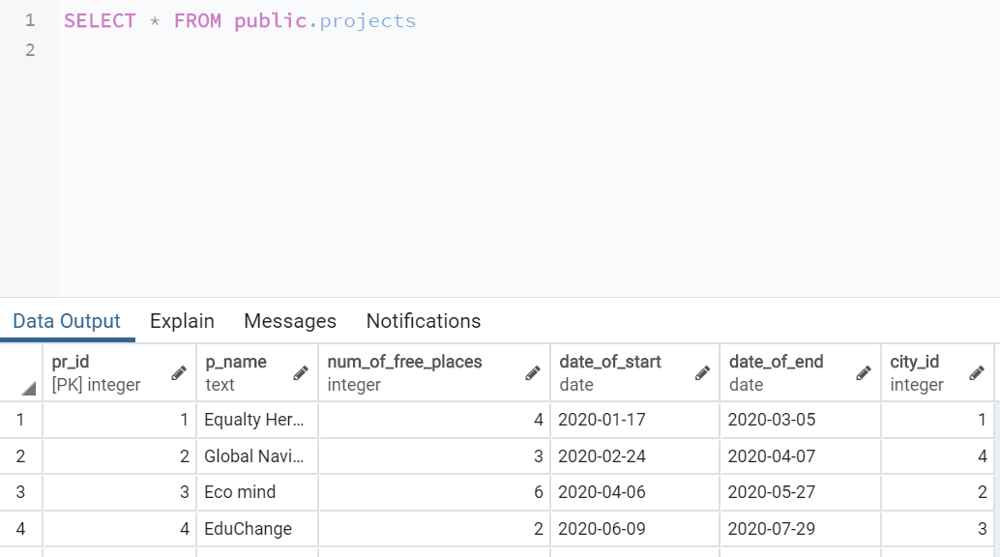
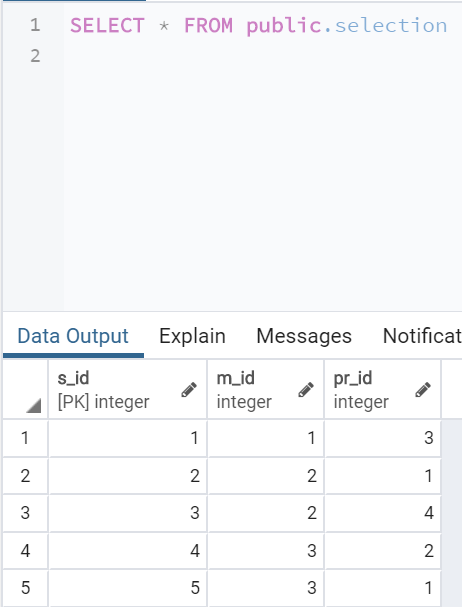
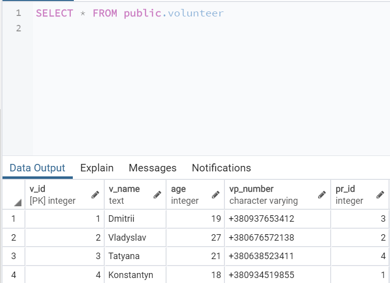
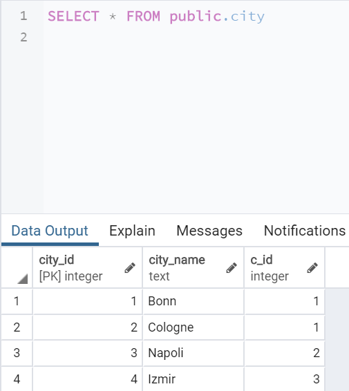
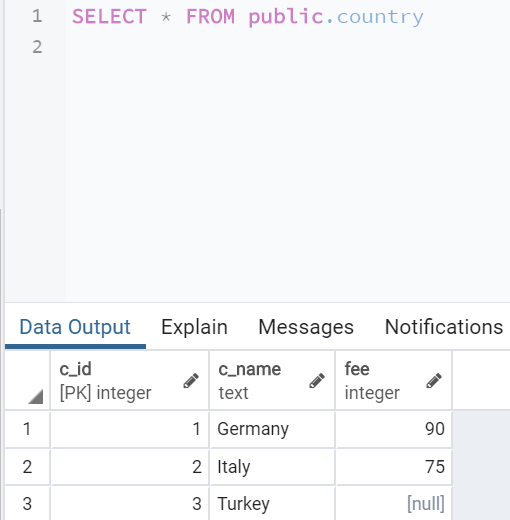

# Lab1_DB
Database lab1

<h3 align="center">Метою роботи є здобуття практичних навичок створення реляційних баз даних за допомогою PostgreSQL</h3>

<h4>Завдання роботи полягає у наступному:</h4>
<ul>
<li>Ознайомитись із інструментарієм PostgreSQL та pgAdmin 4;</li>
<li>Провести аналіз та опис предметної галузі;</li>
<li>Розробити модель «сутність-зв’язок» предметної галузі, обраної студентом самостійно, відповідно до пункту «Вимоги до ER-моделі»;</li>
<li>Перетворити розроблену модель у схему бази даних (таблиці) PostgreSQL та внести декілька рядків даних у кожну з таблиць засобами pgAdmin 4.</li>
  </ul>

<h4 align="center">Опис предметної галузі</h4>
При проектуванні бази даних “Волонтерство за кордоном” можна виділити такі сутності: Менеджер (EP manager), Проект (Project), Волонтер (Volunteer), Країна (Country), Місто (City).
Один менеджер може підібрати кілька проектів, і  декілька менеджерів може підібрати один і той самий проект (N:M).
Один проект можуть обрати декілька волонтерів (1:N).
В одному місті  можуть реалізовуватись кілька проектів (1:N).
В одній країні декілька міст (1:N).

<h4 align="center">Концептуальна модель учбової предметної області "Волонтерство за кордоном"</h4>

<h4 align="center">Опис структури БД “Волонтерство за кордоном”</h4>

<h4 align="center">Структура БД “Волонтерство за кордоном”</h4>

<h4 align="center">Фотографії таблиць з БД</h4>

